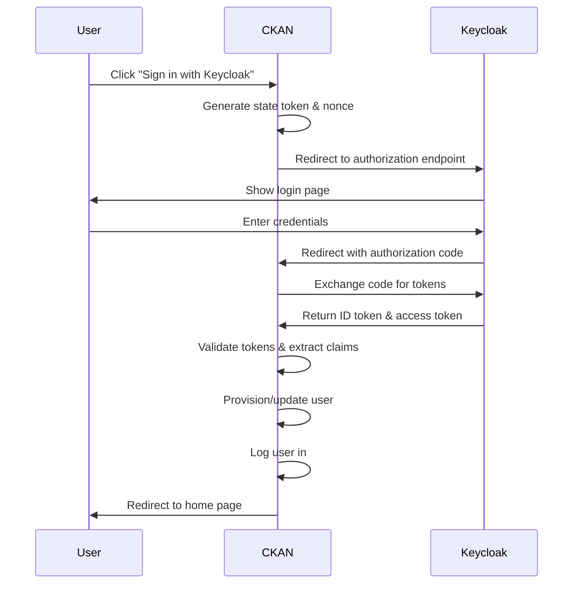

# OIDC SSO Implementation for CKAN SPMS Theme

This document describes the OpenID Connect (OIDC) Single Sign-On (SSO) implementation for the CKAN SPMS Theme extension, enabling authentication via Keycloak.

## Overview

The OIDC SSO integration allows users to authenticate using their Keycloak credentials instead of creating separate CKAN accounts. This implementation provides:

- **Single Sign-On**: Users can log in using their existing Keycloak accounts
- **Automatic User Provisioning**: New users are automatically created in CKAN
- **Group/Role Mapping**: Keycloak groups/roles are mapped to CKAN organizations
- **Sysadmin Management**: Automatic sysadmin rights based on Keycloak groups
- **Seamless Integration**: SSO button appears on the login page alongside traditional login

## Architecture

### Components

1. **OIDC Client** (`src/ckanext-oidc/ckanext/oidc/oidc/client.py`)
   - Handles OIDC protocol communication with Keycloak
   - Manages token exchange and validation
   - Implements security measures (state tokens, nonce validation)

2. **User Authenticator** (`src/ckanext-oidc/ckanext/oidc/oidc/authenticator.py`)
   - Processes OIDC claims and provisions users
   - Handles username sanitization for CKAN compatibility
   - Manages group memberships and sysadmin rights

3. **Views/Routes** (`src/ckanext-oidc/ckanext/oidc/views/oidc_views.py`)
   - Provides OIDC authentication endpoints (`/oidc/login`, `/oidc/callback`, `/oidc/logout`)
   - Handles authentication flow and error handling

4. **Utility Functions** (`src/ckanext-oidc/ckanext/oidc/oidc/utils.py`)
   - Configuration management and helper functions
   - State token generation and validation

5. **Template Integration** (`src/ckanext-oidc/ckanext/oidc/templates/`)
   - SSO button component in login page
   - Configurable button positioning and styling

### Authentication Flow



## Configuration

All OIDC settings are configured via environment variables in the `.env` file:

### Required Configuration

```bash
# Enable OIDC authentication
CKAN__CKANEXT__OIDC__ENABLED=true

# Keycloak server configuration
CKAN__CKANEXT__OIDC__PROVIDER_URL=https://keycloak.apps.lab.dl.min-saude.pt
CKAN__CKANEXT__OIDC__REALM=master
CKAN__CKANEXT__OIDC__CLIENT_ID=ckan
CKAN__CKANEXT__OIDC__CLIENT_SECRET=your_client_secret

# OIDC scopes
CKAN__CKANEXT__OIDC__SCOPE=openid profile email

# User attribute mapping
CKAN__CKANEXT__OIDC__USERNAME_CLAIM=email
CKAN__CKANEXT__OIDC__EMAIL_CLAIM=email
CKAN__CKANEXT__OIDC__FULLNAME_CLAIM=name
CKAN__CKANEXT__OIDC__GROUPS_CLAIM=datalake_roles
```

### Optional Configuration

```bash
# SSL verification (set to false for development)
CKAN__CKANEXT__OIDC__VERIFY_SSL=false

# Authorization settings
CKAN__CKANEXT__OIDC__SYSADMIN_GROUPS=DevOps/SRE Admin
CKAN__CKANEXT__OIDC__DEFAULT_ORGANIZATION=
CKAN__CKANEXT__OIDC__AUTO_PROVISION_USERS=true
CKAN__CKANEXT__OIDC__AUTO_CREATE_ORGANIZATIONS=false
CKAN__CKANEXT__OIDC__ALLOW_LOCAL_LOGIN=true

# UI Configuration
CKAN__CKANEXT__OIDC__BUTTON_TEXT=Sign in with Keycloak
CKAN__CKANEXT__OIDC__BUTTON_ICON=fa-key
CKAN__CKANEXT__OIDC__BUTTON_POSITION=top
```

### Configuration Reference

| Setting | Default | Description |
|---------|---------|-------------|
| `enabled` | `false` | Enable/disable OIDC authentication |
| `provider_url` | - | Base URL of the Keycloak server |
| `realm` | - | Keycloak realm name |
| `client_id` | - | OIDC client ID configured in Keycloak |
| `client_secret` | - | OIDC client secret |
| `scope` | `openid profile email` | OIDC scopes to request |
| `verify_ssl` | `true` | Verify SSL certificates |
| `username_claim` | `preferred_username` | Claim to use for username |
| `email_claim` | `email` | Claim to use for email |
| `fullname_claim` | `name` | Claim to use for full name |
| `groups_claim` | `groups` | Claim containing user groups/roles |
| `sysadmin_groups` | - | Comma-separated list of groups that grant sysadmin rights |
| `default_organization` | - | Default organization for new users |
| `auto_provision_users` | `false` | Automatically create new users (⚠️ Security: Enable only if needed) |
| `auto_create_organizations` | `false` | Auto-create organizations from groups |
| `revoke_sysadmin_on_missing_group` | `false` | Revoke sysadmin rights when user removed from admin groups |
| `allow_local_login` | `true` | Allow traditional CKAN login alongside SSO |
| `button_text` | `Sign in with SSO` | Text displayed on SSO button |
| `button_icon` | `fa-sign-in-alt` | FontAwesome icon for SSO button |
| `button_position` | `top` | Position of SSO button (`top`, `bottom`, `only`) |

## Keycloak Setup

### Client Configuration

1. **Create OIDC Client in Keycloak**:
   - Client ID: `ckan`
   - Client Protocol: `openid-connect`
   - Access Type: `confidential`
   - Standard Flow Enabled: `ON`
   - Direct Access Grants Enabled: `OFF`

2. **Configure Redirect URIs**:
   ```
   https://your-ckan-domain.com/oidc/callback
   ```

3. **Client Scopes**:
   - Ensure `openid`, `profile`, and `email` scopes are available
   - Add custom scope for groups/roles if needed

4. **Mappers** (if custom claims are needed):
   - Create group membership mapper for `datalake_roles` claim
   - Configure email, name, and username mappers

### Required Claims

The OIDC ID token must include:
- `email`: User's email address
- `name`: User's full name
- `preferred_username`: Username (typically email)
- `datalake_roles`: Array of user groups/roles (custom claim)

## User Management

### Username Handling

CKAN has strict username requirements (alphanumeric + underscore/dash only). The implementation:

1. **Takes email from OIDC claims** (e.g., `user@example.com`)
2. **Sanitizes for CKAN compatibility** (e.g., `user_example_com`)
3. **Stores original email** in the user's email field

### User Provisioning

When a user logs in via OIDC:

1. **Extract claims** from the ID token
2. **Check if user exists** (by username or email)
3. **Create new user** if auto-provisioning is enabled
4. **Update existing user** information
5. **Process group memberships** and create organization memberships
6. **Set sysadmin status** based on group membership
7. **Log user into CKAN** with proper session management

### Group/Organization Mapping

Users' Keycloak groups are mapped to CKAN organizations:
- Group names are sanitized for CKAN compatibility
- Organizations can be auto-created if configured
- Users are added as members with configurable roles

## Security Features

### State Token Validation
- Prevents CSRF attacks during OIDC flow
- Generated per-request and stored in session
- Validated on callback to ensure request integrity

### Nonce Validation
- Prevents replay attacks
- Unique value generated per authentication request
- Validated against ID token claims

### Token Validation
- ID tokens are cryptographically verified
- Signature validation using Keycloak's public keys
- Expiration and issuer validation

### User Provisioning Security
- **Auto-provisioning is disabled by default** for security
- When disabled, users must be pre-created in CKAN with proper permissions
- Enable auto-provisioning only in trusted environments
- Group-based sysadmin grants require explicit configuration

### SSL/TLS
- HTTPS enforced for production deployments
- SSL verification configurable for development

## Endpoints

### `/oidc/login`
**Method**: GET
**Description**: Initiates OIDC authentication flow
**Parameters**:
- `came_from` (optional): URL to redirect to after successful login

**Flow**:
1. Generate state token and nonce
2. Store in session for later validation
3. Redirect to Keycloak authorization endpoint

### `/oidc/callback`
**Method**: GET
**Description**: Handles OIDC callback with authorization code
**Parameters**:
- `code`: Authorization code from Keycloak
- `state`: State token for CSRF protection
- `error`: Error code (if authentication failed)

**Flow**:
1. Validate state token
2. Exchange authorization code for tokens
3. Validate ID token
4. Extract user claims
5. Provision/update user
6. Log user in and redirect

### `/oidc/logout`
**Method**: GET
**Description**: Logs user out of CKAN and optionally Keycloak
**Parameters**:
- `redirect_uri` (optional): URL to redirect to after logout

## Error Handling

### Common Errors

1. **"Invalid state token"**
   - Cause: CSRF protection triggered or session expired
   - Solution: Try logging in again

2. **"Failed to create user"**
   - Cause: Username validation failed or database constraints
   - Solution: Check username sanitization logic

3. **"Authentication failed"**
   - Cause: Token validation failed or claims missing
   - Solution: Check Keycloak configuration and client setup

4. **"SSL verification failed"**
   - Cause: Certificate validation issues
   - Solution: Set `verify_ssl=false` for development or fix certificates

### Debugging

Enable debug logging in CKAN to see detailed OIDC flow:

```bash
# In CKAN configuration
ckan.root_path = /srv/app/src/ckan
ckan.site_url = https://your-domain.com
ckan.debug = true

# Or via environment
CKAN__DEBUG=true
```

Check logs for:
- OIDC claim processing
- User creation/update attempts
- Token validation results
- Group membership processing

## Development

### Running Locally

1. **Start services**:
   ```bash
   docker-compose -f docker-compose.dev.yml up -d
   ```

2. **Check logs**:
   ```bash
   docker-compose -f docker-compose.dev.yml logs -f ckan-dev
   ```

3. **Test authentication**:
   - Navigate to `https://ckan-dev.ckan-docker.orb.local/user/login`
   - Click "Sign in with Keycloak" button
   - Complete Keycloak authentication
   - Verify user creation and login

### Testing

**Manual Testing Checklist**:
- [ ] SSO button appears on login page
- [ ] OIDC flow redirects to Keycloak correctly
- [ ] User can authenticate with Keycloak credentials
- [ ] New user is created with correct information
- [ ] Existing user information is updated
- [ ] User is logged into CKAN after authentication
- [ ] Login button disappears for authenticated users
- [ ] Group memberships are processed correctly
- [ ] Sysadmin rights are granted/revoked appropriately
- [ ] Logout works correctly

## Troubleshooting

### User Not Staying Logged In

**Symptoms**: User authenticates successfully but login button still appears

**Causes & Solutions**:
1. **Session not persisted**: Check Flask-Login integration
2. **User state is 'deleted'**: Ensure user is created with 'active' state
3. **Username conflicts**: Check for duplicate users with different states

### Username Sanitization Issues

**Symptoms**: User creation fails with username validation errors

**Solutions**:
1. Ensure email addresses are properly sanitized (@ and . replaced with _)
2. Check that usernames don't start with dash or underscore
3. Verify username length is under 100 characters

### SSL/Certificate Issues

**Symptoms**: "SSL verification failed" errors

**Solutions**:
1. For development: Set `verify_ssl=false`
2. For production: Ensure proper SSL certificates
3. Check Keycloak certificate chain

### Keycloak Configuration Issues

**Symptoms**: Redirect errors or authentication failures

**Solutions**:
1. Verify redirect URIs in Keycloak client configuration
2. Check client secret matches environment configuration
3. Ensure required scopes are available
4. Verify user has necessary group memberships

## Production Considerations

### Security
- Always use HTTPS in production
- Keep client secrets secure and rotate regularly
- Enable SSL verification (`verify_ssl=true`)
- Regularly update dependencies

### Performance
- OIDC adds network calls during authentication
- Consider implementing token caching for repeated requests
- Monitor authentication flow performance

### Monitoring
- Log authentication attempts and failures
- Monitor user creation/update patterns
- Track group membership changes
- Set up alerts for authentication errors

### Backup
- Include OIDC configuration in backup procedures
- Document Keycloak client configuration
- Maintain emergency admin access methods

## Dependencies

The implementation requires the following Python packages (automatically installed):

```
authlib>=1.2.0
pyjwt>=2.4.0
cryptography>=3.4.8
requests>=2.25.1
```

## Support

For issues or questions regarding the OIDC SSO implementation:

1. Check this documentation first
2. Review CKAN logs for specific error messages
3. Verify Keycloak configuration matches requirements
4. Test with a minimal configuration to isolate issues

## Changelog

### Version 1.0.0
- Initial OIDC SSO implementation
- Support for Keycloak authentication
- User auto-provisioning
- Group/organization mapping
- Configurable SSO button
- Comprehensive error handling
- Security features (state tokens, nonce validation)